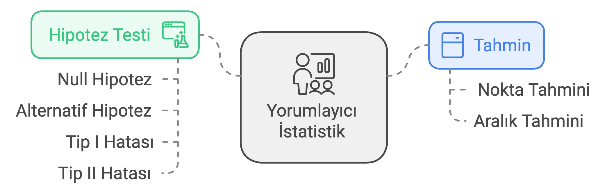
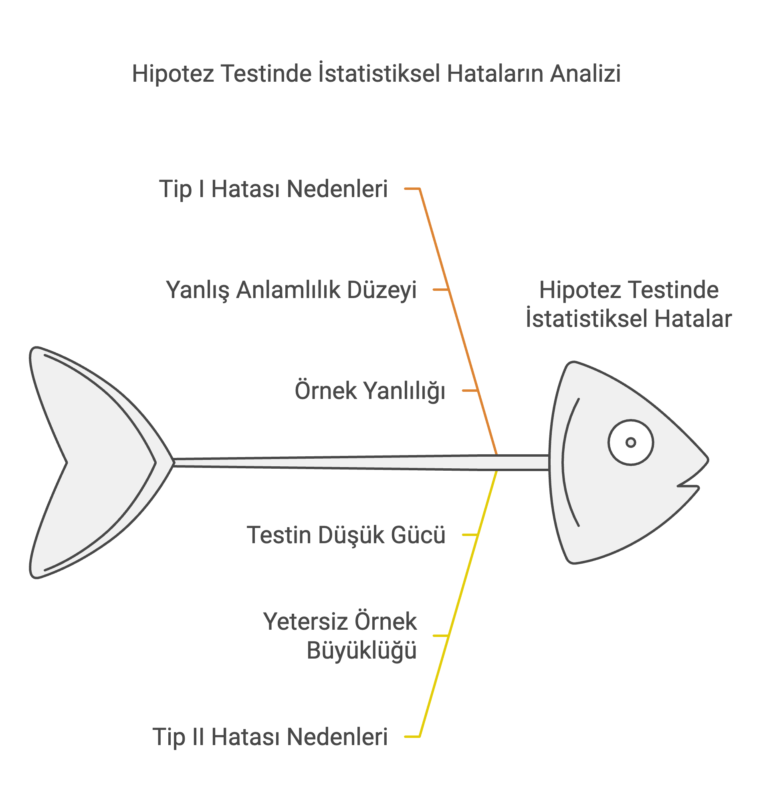

# Hipotez Testi

**Hipotez testi**, bir popülasyon hakkında öne sürülen bir iddianın (hipotezin) istatistiksel olarak doğrulanması veya reddedilmesi için kullanılan bir istatistiksel yöntemdir. Fakat unutmayalım, **hipotez testi**, örneklemden elde edilen verilerden hareketle popülasyonla ilgili bir karar verme sürecini ifade eder.

**Hipotez testi**, yalnızca verilerle desteklenmiş iddiaları kabul ederek objektif ve güvenilir sonuçlara ulaşmamıza olanak tanır ve bu yönüyle de oldukça yaygın olarak kullanılan bir istatistiksel yöntemdir.

Aşağıdaki şema, hipotez testinin **yorumlayıcı (çıkarımsal) istatistik** içindeki yerini gösterir. Modül 09'da gördüğümüz tahmin (güven aralığı) ile Modül 11-12'de göreceğimiz regresyon ve korelasyon analizi, hipotez testiyle aynı ailenin — örneklemden popülasyona çıkarım yapma — farklı araçlarıdır:


## **Temel Kavramlar:**

Bu modülde odaklanacağımız dört temel kavram aşağıdaki şemada özetlenmiştir:



1.  **Null Hipotez (**$H_0$):

    -   Genellikle "hiçbir fark yoktur" veya "etki yoktur" iddiasını temsil eder.

    -   Örneğin: Bir ilaç, mevcut tedaviye göre daha etkili değildir ($H_0: \mu_1 = \mu_2$).

2.  **Alternatif Hipotez (**$H_a$ ya da $H_1$):

    -   Null hipoteze karşı öne sürülen iddiadır.

    -   Örneğin: Bir ilaç, mevcut tedaviye göre daha etkilidir ($H_1: \mu_1 > \mu_2$).

3.  **Test İstatistiği:**

    -   Hipotez testi için kullanılan hesaplama, genellikle t-skoru veya z-skorudur. Bu istatistik, örneklem verilerinin null hipotezle ne kadar uyumlu olduğunu ölçer.

4.  **Anlamlılık Düzeyi (**$\alpha$):

    -   Hata yapma ihtimalini ifade eder. Tipik olarak %5 ($\alpha = 0.05$) seçilir.

    -   **Tip I ve Tip II Hataları:**

        -   **Tip I Hatası**: Bu hata, null hipotez ($H_0$) doğru olduğu halde yanlışlıkla reddedildiğinde meydana gelir. Bu, "yanlış pozitif" hata olarak da bilinir.

        -   **Tip II Hatası**: Bu hata, null hipotez ($H_0$) yanlış olduğu halde reddedilmediğinde meydana gelir. Bu durum "yanlış negatif" hata olarak adlandırılır.

    ::: callout-note
    👋 **Mahkeme Davası Benzetmesi ile Tip I ve Tip II Hataları**

    Bir mahkeme davasında, bir sanık suçu kanıtlanana kadar masum kabul edilir (Masumiyet Karinesi hukukun en temel ilkelerindendir). Bu durum, hipotez testine şu şekillerde benzer:

    -   **Null Hipotez (**$H_0$): Sanık masumdur.

    -   **Alternatif Hipotez (**$H_a$): Sanık suçludur.

    -   **Tip I Hatası**: Sanık masumdur, ancak yanlış bir şekilde suçlu bulunur.

    -   **Tip II Hatası**: Sanık suçludur, ancak yanlış bir şekilde beraat eder.
    :::

    ::: callout-warning
    ⚠️ **P-Hacking (P-Değeri Avcılığı) ve Replikasyon Krizi**

    $\alpha = 0.05$ eşiği, **her bir test için** kabul edilen Tip I Hatası riskidir — 20 farklı değişkeni birbiriyle test ederseniz, aralarından **şans eseri** en az birinin $p < 0.05$ çıkması sürpriz değildir. Araştırmacıların istedikleri p-değerini bulana kadar veriden değişken çıkarıp eklemesi ("p-hacking") ya da yalnızca anlamlı çıkan sonuçları raporlaması, sosyal bilimlerde ciddi bir güvenilirlik sorununa — literatürde **"Replikasyon Krizi"** olarak anılan olguya — yol açmıştır. Bu yüzden p-değeri sihirli bir doğru/yanlış butonu değildir; hipotezler veriye bakmadan **önce** kurulmalı ve testler önceden belirlenmiş sayıda çalıştırılmalıdır.
    :::

    -   **P-Değeri:**

        -   **P-değeri (p-value)**, bir istatistiksel testte, null hipotezin ($H_0$) doğru olduğu varsayımı altında, elde edilen test istatistiği kadar veya daha uç bir sonucun ortaya çıkma olasılığını ifade eden bir değerdir.

        -   P-değeri, hipotez testindeki anlamlılık düzeyini (örneğin, $\alpha = 0.05$) değerlendirmek için kullanılır.

        -   Küçük bir p-değeri (genellikle $p < \alpha$):

            -   Elde edilen sonuçların null hipotezle açıklanmasının zor olduğunu ve alternatif hipotezin ($H_a$) daha olası olduğunu gösterir.

        -   Büyük bir p-değeri (genellikle $p > \alpha$):

            -   Elde edilen sonuçların null hipotezle uyumlu olduğunu ve $H_0$'ı reddetmek için yeterli kanıt olmadığını gösterir.

    

5.  **Karar:**

-   **Eğer p-değeri** $\alpha$'dan küçükse:

    -   **$H_0$ reddedilir ve $H_1$ kabul edilir.**\
        Bu durumda, p-değeri, gözlemlenen sonuçların null hipotez ($H_0$) doğruyken oluşma olasılığının çok düşük olduğunu gösterir. Bu nedenle, $H_0$ reddedilir ve alternatif hipotez ($H_1$) desteklenir.

-   **Eğer p-değeri** $\alpha$'dan büyükse:

    -   **$H_0$ reddedilmez.**\
        Ancak, bu durum $H_0$'ın kesinlikle doğru olduğu anlamına gelmez. Sadece, $H_0$'yı reddetmek için yeterince güçlü kanıt bulunmadığını ifade eder.

Bu ifade, mahkeme analojisiyle şu şekilde açıklanabilir: Sanık hukukun genel ilkelerinden biri olan masumiyet karinesi uyarınca başlangıçta suçsuz kabul edilir ($H_0$), ancak mahkeme sürecinde suçluluğunu kanıtlamak için yeterli delil olmadığında sanık beraat eder. Bu, sanığın masum olduğunu kesin olarak kanıtlamaz; yalnızca suçlu olduğuna dair yeterli kanıt bulunmadığını gösterir.

-   **P-Değeri ve Anlamlılık Düzeyi (**$\alpha$**) Arasındaki İlişki:**

| **P-Değeri** | **Sonuç** |
|----|----|
| $p < 0.01$ | Çok güçlü bir şekilde $H_0$ reddedilir (sonuç oldukça anlamlıdır). |
| $0.01 \le p < 0.05$ | $H_0$ reddedilir (sonuç anlamlıdır). |
| $0.05 \le p < 0.10$ | Zayıf bir şekilde $H_0$ reddedilir (sonuç marjinal olarak anlamlıdır). |
| $p \ge 0.10$ | $H_0$ reddedilmez (sonuç anlamlı değildir). |

------------------------------------------------------------------------

## **Adım Adım Hipotez Testi Süreci**

#### **Adım 1: Hipotezleri Belirle**

İlk olarak, null hipotezi ($H_0$) ve alternatif hipotezi ($H_a$) tanımlayın. Bu hipotezler karşılıklı olarak birbirini dışlamalı ve birlikte tüm olasılıkları kapsamalıdır.

-   **Null Hipotez (**$H_0$): Genellikle, bir etkinin olmadığı veya gruplar arasında fark bulunmadığını ifade eder.\
    Örneğin: "Farklı öğretim yöntemleriyle eğitim alan öğrenciler arasında test puanı ortalamaları arasında fark yoktur."

-   **Alternatif Hipotez (**$H_a$): Bir etkinin veya farkın olduğunu ifade eder.\
    Örneğin: "Yöntem B ile eğitim alan öğrencilerin ortalama test puanları, Yöntem A ile eğitim alan öğrencilerden daha yüksektir."

#### **Adım 2: Uygun Bir Test Seç**

Veri türüne ve test etmek istediğiniz hipoteze göre bir istatistiksel test seçin. Test seçimi şu faktörlere bağlıdır:

-   **Veri Türü:** Nominal, ordinal, aralık (interval), oran (ratio) gibi.

-   **Verinin Dağılımı:** Normal dağılım olup olmadığı.

-   **Örneklem Büyüklüğü:** Küçük ya da büyük örneklem.

-   **Örneklemler Arası Bağımlılık:** Bağımsız veya eşleştirilmiş (paired) örneklemler.

**Sık Kullanılan Testler:**

-   **t-Testi:** Tek bir grubun ortalamasını veya iki grubun ortalamalarını karşılaştırır.

-   **ANOVA:** Üç veya daha fazla grubun ortalamalarını karşılaştırır.

-   **Ki-Kare (Chi-Square) Testi:** Kategorik değişkenler arasındaki ilişkileri test eder.

-   **Regresyon Analizi:** Değişkenler arasındaki ilişkileri anlamak için kullanılır (bkz. Modül 11-12).

#### **Adım 3: Test İstatistiğini Hesapla**

Seçtiğiniz teste göre şu adımları izleyin:

1.  Örnek veriyi toplayın.

2.  Seçilen teste uygun formülü kullanarak test istatistiğini hesaplayın. Bu hesaplama genellikle ortalama, standart sapma gibi ölçümleri içerir.

#### **Adım 4: p-Değerini Hesapla ve Yorumla**

-   **p-Değeri:** Verilerinizin (veya daha aşırı sonuçların) null hipotez doğruyken gözlemlenme olasılığını ifade eder.

-   p-değeri, testin anlamlılık düzeyine göre sonuçların istatistiksel olarak önemli olup olmadığını belirler.

#### **Adım 5: Karar Ver (p-Değeri ve Anlamlılık Düzeyi** $\alpha$'ya Göre)

-   **p-değeri** $\le \alpha$: Null hipotezi reddedin (etkiye dair kanıt var).

-   **p-değeri \>** $\alpha$: Null hipotezi reddetmeyin (etki olduğuna dair yeterli kanıt yok).

#### **Adım 6: Sonuçları Raporla**

-   **Hipotez Testi Sonucu:** Null hipotezi reddedip reddetmediğinizi açıkça belirtin.

-   **Sonuçların Yorumlanması:** Bulgularınızın çalışmanın bağlamındaki anlamını tartışın.

::: callout-note
👋 Aşağıda, R'de en yaygın kullanılan hipotez testi yöntemi olan **t-testi** açıklanmıştır!

t.test(x, y = NULL, alternative = c("two.sided", "less", "greater"), mu = 0, paired = FALSE, var.equal = FALSE, conf.level = 0.95, …)

Burada:

-   **x, y:** İki veri örneklemi.

-   **alternative:** Testin alternatif hipotezi.

    -   `"two.sided"`: İki yönlü (farklılık olup olmadığı).

    -   `"less"`: Daha küçük (mu'nun altında olup olmadığını test eder).

    -   `"greater"`: Daha büyük (mu'nun üstünde olup olmadığını test eder).

-   **mu:** Gerçek ortalama değeri.

-   **paired:** Eşleştirilmiş t-testi yapılıp yapılmayacağını belirtir (default: **FALSE**, eşleştirilmiş değil).

-   **var.equal:** Örneklemler arasındaki varyansların eşit olup olmadığını varsaymak.

-   **conf.level:** Kullanılacak güven düzeyi (default: %95 güven düzeyi).
:::

------------------------------------------------------------------------

## Varsayımların Denetlenmesi

Bir hipotez testinin sonucu, ancak testin **varsayımları** karşılandığında güvenilirdir. Bir testi çalıştırıp p-değerini okumak yetmez; sonucu raporlamadan önce o testin dayandığı varsayımların makul ölçüde sağlandığını göstermek gerekir. Aşağıdaki tablo, bu modülde göreceğimiz testlerin en sık denetlenen varsayımlarını ve bunları R'da denetlemenin yollarını özetler:

| Test | Temel Varsayım | R'da Denetleme |
|----|----|----|
| t-testi (tek/iki örneklem) | Verinin (küçük örneklemde) normale yakın dağılması | `shapiro.test()`, `qqnorm()` + `qqline()` |
| İki örneklem t-testi (eşit varyans) | Grup varyanslarının homojenliği | `var.test()`, `bartlett.test()` |
| ANOVA | Normallik, gözlem bağımsızlığı, varyans homojenliği | `shapiro.test(residuals(...))`, `bartlett.test()` |
| Ki-kare | Beklenen hücre frekanslarının yeterince büyük olması (genellikle $\ge 5$) | `chisq.test(...)$expected` |

::: callout-note
👋 **Varsayım ihlal edilirse ne olur?** Test otomatik olarak "yanlış" sonuç vermez, ama p-değerinin güvenilirliği düşer. Örneğin ANOVA'da varyans homojenliği ciddi biçimde bozulmuşsa, `aov()` yerine `oneway.test(var.equal = FALSE)` (Welch ANOVA) tercih edilir. Bu dersin sınavlarında sizden bir varsayım testini **hesaplamanız değil**, hazır bir `shapiro.test()` veya `bartlett.test()` çıktısındaki p-değerini okuyup ne anlama geldiğini **yorumlamanız** istenir — tıpkı aşağıdaki Örnek 6'da olduğu gibi.
:::

------------------------------------------------------------------------

## Etki Büyüklüğü (Effect Size): P-Değeri Tek Başına Yetmez

P-değeri bize bir farkın **var olup olmadığını** söyler, ancak bu farkın **ne kadar büyük veya önemli** olduğunu söylemez. Özellikle büyük örneklemlerde (örneğin 10.000 kişilik bir anket), pratikte hiçbir anlamı olmayan çok küçük bir fark bile istatistiksel olarak anlamlı ($p < 0.05$) çıkabilir — Örnek 7'de tam olarak bunu göreceğiz. Bu yüzden modern sosyal bilim yayınlarında bir test sonucu raporlanırken p-değeriyle birlikte mutlaka bir **etki büyüklüğü** ölçütü de verilir. Bu modülde iki tanesini kullanacağız; her ikisi de temel R fonksiyonlarıyla, ek paket gerektirmeden hesaplanabilir:

-   **Cohen's d** (t-testleri için): İki ortalama arasındaki farkın, verinin standart sapması cinsinden ifadesidir.

    -   Tek örneklem: $d = (\bar{x} - \mu_0) / s$
    -   İki bağımsız örneklem: $d = (\bar{x}_1 - \bar{x}_2) / s_{pooled}$, burada $s_{pooled} = \sqrt{\dfrac{(n_1-1)s_1^2 + (n_2-1)s_2^2}{n_1+n_2-2}}$

    | $|d|$ | Yorum |
    |----|----|
    | $\approx 0.2$ | Küçük etki |
    | $\approx 0.5$ | Orta etki |
    | $\approx 0.8$ ve üzeri | Büyük etki |

-   **Cramér's V** (ki-kare için): $V = \sqrt{\dfrac{\chi^2}{n \times \min(r-1,\, c-1)}}$, burada $r$ ve $c$ tablonun satır/sütun sayısıdır.

    | $V$ | Yorum |
    |----|----|
    | $\approx 0.1$ | Küçük ilişki |
    | $\approx 0.3$ | Orta ilişki |
    | $\approx 0.5$ ve üzeri | Güçlü ilişki |

::: callout-note
👋 Bu değerler R'da paket gerektirmeden, doğrudan formülle hesaplanır (aşağıdaki örneklerde gösterilmiştir). İsterseniz `effectsize` paketindeki `cohens_d()` ve `cramers_v()` fonksiyonları da aynı sonucu otomatik verir, ancak bu ders base R ile ilerlediği için formülü elle yazmayı tercih ediyoruz — bu, formülün ne ölçtüğünü unutmamanızı da sağlar.
:::

------------------------------------------------------------------------

## Örnek 1: Bir Örneklem t-Testi

Bir örneklem t-testi, bir popülasyonun ortalamasının bilinen bir değere eşit olup olmadığını test etmek için kullanılır. Örneğin, bir ülkedeki belediye başkanlarının yaş ortalamasının, o ülkedeki genel yetişkin nüfusun yaş ortalamasından (temsili değer: 40) farklı olup olmadığını merak ettiğimizi varsayalım.

### Adım 1: Hipotezlerin Formülasyonu

-   **Null Hipotezi (**$H_0$**):** Belediye başkanlarının ortalama yaşı 40'tır ($\mu = 40$).

-   **Alternatif Hipotez (**$H_1$**):** Belediye başkanlarının ortalama yaşı 40'tan farklıdır ($\mu \neq 40$).

### Adım 2: Uygun Testin Seçimi

-   **Seçilen Test:** Bir örneklem t-testi, çünkü örneklem ortalamasını bilinen bir referans değeriyle karşılaştırıyoruz.

-   **Veri Türü:** Sürekli (yaş)

-   **Örneklem Büyüklüğü:** 15 belediye başkanı (temsili veri)

### Adım 3: Test İstatistiğinin Hesaplanması

Aşağıdaki R kodunu kullanarak t-testini hesaplayabilirsiniz:

```{r}
# Örneklem verilerini tanımla (temsili veri)
baskan_yaslari <- c(52, 48, 61, 55, 58, 50, 63, 47, 54, 59, 51, 56, 62, 49, 57)

# Bir örneklem t-testi yap
t_test_result <- t.test(baskan_yaslari, mu = 40)
```

### Adım 4: p-değerini Almak ve Yorumlamak

```{r}
# Test sonucunu yazdır
print(t_test_result)
```

**Test Çıktısı Yorumlaması:**

p-değeri (yaklaşık $2.8 \times 10^{-8}$), yaygın $\alpha$ (0.05) seviyesinden önemli ölçüde küçüktür, bu da null hipotezini reddetmek için çok güçlü istatistiksel bir kanıt olduğunu gösterir. Bu durum, örneklemdeki belediye başkanlarının ortalama yaşının 40'tan istatistiksel olarak farklı olduğunu belirtir.

### Adım 5: p-değeri ve Alfa ($\alpha$) Temelinde Karar Vermek

p-değeri ($\approx 2.8 \times 10^{-8}$) $<$ $\alpha$ (0.05) olduğundan, null hipotezini reddedin.

Veriler, belediye başkanlarının ortalama yaşının 40'tan anlamlı şekilde farklı (yüksek) olduğunu göstermektedir.

### Adım 6: Etki Büyüklüğünü Hesaplamak

Böylesine küçük bir p-değeri karşısında akla gelmesi gereken ilk soru şudur: **fark ne kadar büyük?**

```{r}
# Cohen's d (tek örneklem)
ort <- mean(baskan_yaslari)
ss  <- sd(baskan_yaslari)
cohend <- (ort - 40) / ss
cohend
```

$d \approx 2.85$ — yukarıdaki tabloya göre bu **çok büyük bir etkidir**; ortalama yaş, referans değerden neredeyse 3 standart sapma uzaktadır. Burada hem p-değeri hem etki büyüklüğü aynı yönde güçlü bir sonuca işaret ediyor.

### Adım 7: Sonuçları Raporlamak

Bir örneklem t-testi ile belediye başkanlarının ortalama yaşının 40'tan farklı olup olmadığı test edilmiştir. Örneklem ortalaması 54.8 (%95 güven aralığı: 51.92–57.68) olup, bu aralık 40'ı içermediği için null hipotezinin reddedilmesini desteklemektedir. Etki büyüklüğü de ($d \approx 2.85$) bu farkın yalnızca istatistiksel değil, pratik açıdan da büyük olduğunu göstermektedir.

**Raporlama (APA formatına yakın bir cümle):** "Tek örneklem t-testi sonucunda, belediye başkanlarının ortalama yaşı ($M = 54.8$), referans değer olan 40'tan anlamlı şekilde yüksek bulunmuştur, $t(14) = 11.03$, $p < .001$, $d = 2.85$."

### Alternatif Hipotez ile t-Testi: Yönlü Test

Eğer yaş ortalamasının 40'tan **büyük olup olmadığını** (küçük olma ihtimalini baştan dışlayarak) test etmek istiyorsanız, `alternative` argümanını `"greater"` olarak ayarlayabilirsiniz:

```{r}
# H0: mu <= 40, H1: mu > 40
t_test_greater <- t.test(baskan_yaslari, mu = 40, alternative = "greater")
print(t_test_greater)
```

::: callout-note
👋 Yönlü (tek taraflı) hipotez kurarken dikkat: `alternative = "greater"` derseniz hipotezleriniz $H_0: \mu \le 40$ ve $H_1: \mu > 40$ olur; `"less"` derseniz $H_0: \mu \ge 40$ ve $H_1: \mu < 40$ olur. Yön seçimi **veriye bakmadan önce**, araştırma sorusundan gelmelidir — veriyi gördükten sonra "hangi yönde anlamlı çıkıyorsa onu seçmek" tam olarak yukarıdaki p-hacking uyarısının bir örneğidir.
:::

------------------------------------------------------------------------

## Örnek 2: **e-Devlet Memnuniyeti — Anlamsız Çıkan Bir Sonuç**

Önceki örnekte $H_0$ reddedildi. Ama çoğu zaman gerçek veri bu kadar net konuşmaz — bu örnekte **null hipotezin reddedilemediği**, yani "anlamlı fark yok" denilen bir durumu göreceğiz. Bir ilin 10 ilçesinde ölçülen e-devlet hizmetlerinden memnuniyet puanının (100 üzerinden), ulusal ortalama olan 72'den farklı olup olmadığını test edeceğiz.

### **Adım 1: Hipotezlerin Formülasyonu**

-   **Null Hipotezi (**$H_0$): İlçelerin ortalama memnuniyet puanı 72'dir ($\mu = 72$).

-   **Alternatif Hipotezi (**$H_1$): İlçelerin ortalama memnuniyet puanı 72'den farklıdır ($\mu \neq 72$).

### **Adım 2: Uygun Testin Seçimi**

-   **Test Türü:** Bir örneklem t-testi, çünkü bir örneklem ortalamasını bilinen bir referans değeriyle karşılaştırıyoruz.

-   **Veri Türü:** Sürekli (memnuniyet puanı)

-   **Dağılım:** Küçük örneklemde normallik varsayımı `shapiro.test()` ile kontrol edilebilir (bkz. "Varsayımların Denetlenmesi").

### **Adım 3: Test İstatistiğinin Hesaplanması**

R kodu ile testi gerçekleştirelim:

```{r}
# Örneklem verilerini tanımla (temsili veri, 10 ilçe)
memnuniyet <- c(74, 70, 73, 69, 75, 71, 76, 68, 72, 77)

# 72'ye karşı bir örneklem t-testi yap
t_test_result <- t.test(memnuniyet, mu = 72)
```

### Adım 4: p-Değerinin Alınması ve Yorumlanması

```{r}
# Test sonuçlarını yazdır
print(t_test_result)
```

**Test Çıktısının Yorumu:**

-   **p-değeri ($\approx 0.614$):** Bu değer, yaygın olarak kullanılan anlamlılık seviyesi ($\alpha = 0.05$) ile karşılaştırıldığında çok büyüktür. Bu, null hipotezi reddetmek için yeterli kanıt olmadığını gösterir.

-   **Sonuç:** İlçelerin ortalama memnuniyet puanının ulusal ortalama olan 72'den anlamlı bir şekilde farklı olduğunu söylemek için yeterli kanıt yoktur.

### **Adım 5: Karar Ver (p-değeri ve** $\alpha$'ya Göre)

-   **p-değeri ($\approx 0.614$) \>** $\alpha$ (0.05): Null hipotezi reddetmeyin.

-   Bu karar, ilçelerin ortalama memnuniyetinin ulusal ortalamadan farklı olmadığı anlamına gelir.

### **Adım 6: Etki Büyüklüğünü Hesaplamak**

Bu, p-değerinin küçük olmadığı bir durumda etki büyüklüğünün neden yine de raporlanması gerektiğini gösteren iyi bir örnektir:

```{r}
ort <- mean(memnuniyet)
ss  <- sd(memnuniyet)
cohend <- (ort - 72) / ss
cohend
```

$d \approx 0.17$ — tabloya göre bu **ihmal edilebilir bir etkidir**. Burada p-değeri ve etki büyüklüğü **aynı hikâyeyi anlatıyor**: hem istatistiksel olarak hem pratik olarak anlamlı bir fark yok. (Örnek 7'de bunun tam tersini — p-değeri çok küçükken etki büyüklüğünün küçük çıktığı bir durumu — göreceğiz.)

### **Adım 7: Sonuçları Raporlamak**

İlçelerin ortalama memnuniyet puanının 72'den farklı olup olmadığını değerlendirmek için bir t-testi yapıldı. Örneklem ortalaması 72.5 (%95 güven aralığı: 70.33–74.67) olup, bu aralık 72'yi içerdiğinden null hipotezin reddedilmesi desteklenmemektedir. Etki büyüklüğü de ($d \approx 0.17$) farkın pratikte önemsiz olduğunu doğrulamaktadır.

**Raporlama (APA formatına yakın bir cümle):** "Tek örneklem t-testi sonucunda, ilçelerin ortalama memnuniyet puanı ($M = 72.5$) ile ulusal ortalama (72) arasında anlamlı bir fark bulunmamıştır, $t(9) = 0.52$, $p = .614$, $d = 0.17$."

------------------------------------------------------------------------

## **Örnek 3: Eşleştirilmiş Örneklem t-Testi**

Eşleştirilmiş örneklem t-testi, bir örneklemdeki her bir gözlemin diğer bir örneklemdeki eşleşmiş bir gözlemle karşılaştırılabildiği durumlarda iki örneklemin ortalamalarını karşılaştırmak için kullanılır.

### **Senaryo:**

Bir belediyenin, gişe personeline verdiği vatandaş memnuniyeti eğitim programının etkili olup olmadığını bilmek istiyoruz.

Bunu test etmek için 12 belediyenin gişe hizmetlerinden vatandaş memnuniyeti (100 üzerinden) eğitim programı **öncesinde** ölçülür. Aynı 12 belediyede eğitim programı uygulandıktan bir süre sonra memnuniyet **tekrar** ölçülür.

Bu senaryoda, aynı belediyelerin eğitim öncesi ve sonrası memnuniyet puanlarını karşılaştırmak için **eşleştirilmiş örneklem t-testi** uygun bir yöntemdir — çünkü iki ölçüm aynı birimlerden (belediyelerden) geliyor. İşte bu hipotez testini adım adım nasıl gerçekleştireceğiniz:

------------------------------------------------------------------------

### **Adım 1: Hipotezleri Belirleme**

-   **Null Hipotezi (**$H_0$): Eğitim programının vatandaş memnuniyeti üzerinde hiçbir etkisi yoktur. Matematiksel olarak: $\mu_d = 0$ — eğitim öncesi ve sonrası memnuniyet puanları arasındaki farkın ortalamasıdır.

-   **Alternatif Hipotezi (**$H_1$): Eğitim programının vatandaş memnuniyeti üzerinde etkisi vardır. Matematiksel olarak: $\mu_d \neq 0$.

------------------------------------------------------------------------

### **Adım 2: Uygun Testi Seçme**

Bu durumda, iki ölçüm aynı belediyelerden alındığı için birimler-arası değişkenliği kontrol eden **eşleştirilmiş örneklem t-testi** en uygun yöntemdir.

-   **Test Türü:** Eşleştirilmiş t-testi.

-   **Veri Türü:** Sürekli (memnuniyet puanı).

------------------------------------------------------------------------

### **Adım 3: Test İstatistiğini Hesaplama**

R kodu ile testi gerçekleştirelim:

```{r}
# Eğitim öncesi ve sonrası memnuniyet puanlarını tanımlayın (temsili veri, 12 belediye)
egitim_oncesi <- c(62, 58, 65, 60, 55, 63, 59, 61, 57, 70, 60, 56)
egitim_sonrasi <- c(68, 60, 70, 58, 59, 66, 63, 65, 61, 69, 62, 64)

# Eşleştirilmiş t-testi yapın
paired_t_test_result <- t.test(x = egitim_oncesi, y = egitim_sonrasi, paired = TRUE)
```

### Adım 4: p-Değerinin Alınması ve Yorumlanması

```{r}
# Test sonucunu yazdır
print(paired_t_test_result)
```

**p-değeri:** $\approx 0.0019$. Bu değer, null hipotez doğruyken gözlemlenen veya daha uç bir test istatistiği elde etme olasılığını temsil eder.

### **Adım 5: p-Değeri ve Alfa (**$\alpha$**) Temelinde Karar Verme**

-   **p-değeri ($\approx 0.0019$) \<** $\alpha$ (0.05): Null hipotez reddedilir.

-   Bu karar, eğitim programının vatandaş memnuniyeti üzerinde etkisi olduğunu göstermektedir.

### **Adım 6: Etki Büyüklüğünü Hesaplamak**

```{r}
fark <- egitim_sonrasi - egitim_oncesi
cohend <- mean(fark) / sd(fark)
cohend
```

$d \approx 1.17$ — bu, tabloya göre **büyük bir etkidir**. Yani eğitim programının etkisi yalnızca istatistiksel olarak anlamlı değil, aynı zamanda pratikte de belirgin büyüklüktedir.

### **Adım 7: Sonuçları Raporlama**

Eşleştirilmiş t-testi yapıldı ve t-istatistiği 4.07, p-değeri $\approx 0.0019$ olarak hesaplandı. Bu değer, eğitim sonrası memnuniyet puanlarının eğitim öncesine göre anlamlı şekilde arttığını gösteriyor.

%95 güven aralığı 1.49 ile 5.01 puan arasındadır ve 0'ı içermediği için null hipotezi reddetmeyi destekler. Ortalama fark 3.25 puan olup, bu da eğitim sonrası memnuniyetin ortalama 3.25 puan arttığını belirtir. (12 belediyeden 2'sinde memnuniyet hafifçe düşmüş olsa da genel eğilim güçlü ve tutarlı biçimde artış yönündedir.)

Sonuç olarak, eğitim programı vatandaş memnuniyetini artırmada etkili ve büyüklüğü pratik açıdan da önemli bulunmuştur.

**Raporlama (APA formatına yakın bir cümle):** "Eşleştirilmiş örneklem t-testi sonucunda, eğitim sonrası memnuniyet puanları ($M = 63.75$), eğitim öncesine ($M = 60.5$) göre anlamlı şekilde yüksek bulunmuştur, $t(11) = 4.07$, $p = .002$, $d = 1.17$."

------------------------------------------------------------------------

## Örnek 4: **İki Örneklem t-Testi**

Bir araştırmacı, rejim türünün kişi başına düşen GSYİH ile ilişkili olup olmadığını merak ediyor. Aşağıdaki veri **temsili/kurgusaldır** — gerçek bir araştırmanın bulgusu değildir, yalnızca bağımsız iki örneklem t-testinin mantığını göstermek için kullanılmıştır (gerçek karşılaştırmalı siyaset verisiyle çalışmak isterseniz V-Dem veya Polity5 veri setlerine bakabilirsiniz).

### **Adım 1: Hipotezlerin Belirlenmesi**

-   **Null Hipotezi (**$H_0$): Demokrasi grubundaki ülkelerin ortalama kişi başı GSYİH'si (bin USD), otokrasi grubundakiyle eşittir. Matematiksel olarak: $\mu_1 = \mu_2$.

-   **Alternatif Hipotezi (**$H_1$): İki grubun ortalama kişi başı GSYİH'si eşit değildir. Matematiksel olarak: $\mu_1 \neq \mu_2$.

------------------------------------------------------------------------

### **Adım 2: Uygun Testin Seçilmesi**

-   İki bağımsız örneklemin (iki farklı ülke grubu) ortalamalarını karşılaştırmak için **iki örneklem t-testi** uygundur.

-   Bu test, her iki grubun verilerinin normal dağıldığı ve varyanslarının eşit olduğu varsayımı altında kullanılabilir (varyansların eşit olup olmadığını `bartlett.test()` ile kontrol edeceğiz).

------------------------------------------------------------------------

### **Adım 3: Test İstatistiğinin Hesaplanması**

Aşağıdaki R kodu ile testi gerçekleştirin:

```{r}
# Örnek verileri tanımla (temsili veri, kisi basi GSYIH, bin USD)
demokrasi <- c(38, 41, 35, 44, 39, 42, 37, 40)
otokrasi  <- c(22, 19, 25, 21, 18, 24, 20, 23)

# Varyans homojenligini denetle
bartlett.test(list(demokrasi, otokrasi))

# Esit varyans varsayimi ile iki örneklem t-testi yap
t_test_result <- t.test(demokrasi, otokrasi, alternative = "two.sided", var.equal = TRUE)
```

### Adım 4: p-Değerinin Alınması ve Yorumlanması

```{r}
# Test sonucunu yazdır
print(t_test_result)
```

-   **Varsayım denetimi:** `bartlett.test()` p-değeri ($\approx 0.68$) 0.05'ten büyük olduğundan, varyans homojenliği varsayımı korunuyor ve `var.equal = TRUE` seçimimiz haklıdır.

-   **p-Değeri:** $\approx 2.1 \times 10^{-9}$. Bu çok küçük değer, null hipotezin doğru olduğu varsayımı altında gözlemlenen fark kadar veya daha büyük bir farkın oluşma olasılığının neredeyse sıfır olduğunu ifade eder.

-   **Yorum:** p-değeri, yaygın olarak kullanılan anlamlılık seviyesi ($\alpha = 0.05$) ile karşılaştırıldığında son derece küçüktür ve null hipoteze karşı çok güçlü kanıt sağlar.

### **Adım 5: p-Değeri ve Alfa (**$\alpha$**) Temelinde Karar Verme**

-   **Karar:** p-değeri 0.05'ten çok daha küçük olduğu için null hipotez reddedilir.

-   **Sonuç:** İki grup arasında ortalama kişi başı GSYİH açısından istatistiksel olarak anlamlı bir fark vardır.

### **Adım 6: Etki Büyüklüğünü Hesaplamak**

```{r}
n1 <- length(demokrasi); n2 <- length(otokrasi)
s1 <- sd(demokrasi); s2 <- sd(otokrasi)
s_pooled <- sqrt(((n1 - 1) * s1^2 + (n2 - 1) * s2^2) / (n1 + n2 - 2))
cohend <- (mean(demokrasi) - mean(otokrasi)) / s_pooled
cohend
```

$d \approx 6.7$ — olağanüstü büyük bir etki. (Bu örnekteki veri, iki grubu bilinçli olarak keskin biçimde ayırarak kurgulanmıştır; gerçek karşılaştırmalı siyaset verisinde etki büyüklükleri genellikle bu kadar uç olmaz.)

### **Adım 7: Sonuçların Raporlanması**

-   **Test Türü:** İki örneklem t-testi (eşit varyans varsayımıyla).

-   **t-İstatistiği:** 13.47. Pozitif işaret, demokrasi grubunun ortalamasının otokrasi grubundan **yüksek** olduğunu gösterir.

-   **Serbestlik Dereceleri:** 14.

-   **Güven Aralığı:** Ortalama fark için %95 güven aralığı: 15.13 ile 20.87 (bin USD). Bu aralık 0'ı içermediği için null hipotezin reddedilmesini destekler.

-   **Ortalama Tahminleri:** Demokrasi grubu 39.5 bin USD, otokrasi grubu 21.5 bin USD.

**Sonuç:** Bu temsili veri setinde, iki grup arasında kişi başı GSYİH açısından anlamlı bir fark vardır.

**Raporlama (APA formatına yakın bir cümle):** "Bağımsız örneklem t-testi sonucunda, demokrasi grubunun ortalama kişi başı GSYİH'si ($M = 39.5$), otokrasi grubundan ($M = 21.5$) anlamlı şekilde yüksek bulunmuştur, $t(14) = 13.47$, $p < .001$, $d = 6.73$."

::: callout-warning
⚠️ **Korelasyon nedensellik değildir.** Bu test bize yalnızca iki grup ortalaması arasında istatistiksel bir fark olduğunu söyler — rejim türünün GSYİH'yi **belirlediğini** değil. Gerçek veride bu ilişkiye kalkınma düzeyi, doğal kaynaklar, sömürge geçmişi gibi pek çok üçüncü değişken karışabilir (bkz. Örnek 7'nin sonundaki Simpson Paradoksu tartışması). Nedensel bir iddia için Modül 11-12'deki **çoklu regresyon** gibi, karıştırıcı değişkenleri kontrol eden yöntemler gerekir.
:::

------------------------------------------------------------------------

## Örnek 5: **Welch İki Örneklem t-Testi — Sınırda Bir Karar**

AB üyesi ülkeler ile AB'ye aday ülkeler arasında yolsuzluk algı endeksi (0-100, yüksek puan = daha az algılanan yolsuzluk) açısından fark olup olmadığını test ediyoruz. Aşağıdaki veri de **temsilidir**; gerçek endeks değerleri için Transparency International'ın yıllık CPI raporlarına bakılmalıdır.

### **Adım 1: Hipotezlerin Belirlenmesi**

-   **Null Hipotezi (**$H_0$): AB üyesi ülkeler ile aday ülkeler arasında ortalama endeks puanı açısından fark yoktur.

-   **Alternatif Hipotezi (**$H_1$): İki grup arasında ortalama endeks puanı açısından fark vardır.

### **Adım 2: Uygun Testin Seçilmesi**

İki bağımsız grubun ortalamalarını karşılaştırmak için **iki örneklem t-testi** uygundur. İki grubun örneklem büyüklükleri farklı olduğundan (9'a 6) ve varyansların otomatik olarak eşit varsayılması riskli olduğundan, güvenli tercih olarak varyansların eşit olduğunu **varsaymayan Welch t-testi** kullanılacaktır — bu, R'da `t.test()`'in zaten **varsayılan** davranışıdır.

### **Adım 3: Test İstatistiğinin Hesaplanması**

Aşağıdaki R kodu ile testi gerçekleştirebilirsiniz:

```{r}
# Örnek verileri tanımla (temsili veri)
ab_uyesi <- c(58, 65, 52, 61, 45, 68, 55, 50, 63)
aday     <- c(48, 42, 55, 51, 40, 58)

# İki örneklem t-testi (varsayılan: Welch t-testi, var.equal = FALSE)
t_test_result <- t.test(ab_uyesi, aday)
```

### Adım 4: p-Değerinin Alınması ve Yorumlanması

```{r}
# Test sonucunu yazdır
print(t_test_result)
```

**p-değeri:** $\approx 0.0495$. Bu değer, null hipotezin doğru olduğu varsayımı altında, iki grup arasındaki fark kadar veya daha büyük bir fark gözlemleme olasılığını ifade eder.

### **Adım 5: p-Değeri ve Alfa (**$\alpha$**) Temelinde Karar Verme**

-   **p-değeri ($\approx 0.0495$) $<$ 0.05:** Null hipotez, tam sınırında olsa da, teknik olarak reddedilir.

::: callout-warning
⚠️ **Sınırda bir p-değeri neden dikkatle okunmalı?** $p = 0.0495$ ile $p = 0.051$ arasındaki fark, istatistiksel olarak neredeyse anlamsızdır — ama biri "anlamlı", diğeri "anlamlı değil" diye raporlanır. $\alpha = 0.05$ eşiği keyfi bir gelenektir, doğa yasası değildir. Böylesine sınırda bir sonucu tek başına, örneklem büyütmeden veya tekrar araştırmadan kesin bir bulgu gibi sunmak, yukarıda değindiğimiz replikasyon krizinin tam da beslendiği yerdir.
:::

### **Adım 6: Etki Büyüklüğünü Hesaplamak**

```{r}
s1 <- sd(ab_uyesi); s2 <- sd(aday)
s_avg <- sqrt((s1^2 + s2^2) / 2)
cohend <- (mean(ab_uyesi) - mean(aday)) / s_avg
cohend
```

$d \approx 1.15$ — büyük bir etki. Burada p-değeri sınırda olsa da etki büyüklüğü küçük bir örneklemle çalıştığımızı ve gücün (power) sınırlı olduğunu hatırlatıyor; daha büyük bir örneklemle aynı etki büyüklüğü çok daha net bir p-değeri verebilirdi.

### **Adım 7: Sonuçları Raporlama**

Welch İki Örneklem t-Testi, AB üyesi ve aday ülkeler arasındaki yolsuzluk algı endeksini karşılaştırmak için yapıldı.

**Test Sonuçları:**

-   **t-İstatistiği:** 2.20 (AB üyesi grubunun puanı, aday grubundan yüksek).

-   **p-Değeri:** $\approx 0.0495$ (sınırda anlamlı).

-   **Güven Aralığı:** yaklaşık 0.02 ile 16.87 (0'ı çok dar bir marjla dışlıyor).

-   **Ortalama Puanlar:** AB üyesi grubu 57.4, aday grubu 49.0.

**Sonuç olarak;** İki grup arasında sınırda, dikkatle yorumlanması gereken bir fark bulunmuştur. Örneklem küçük olduğundan, bu sonucu tek başına kesin kabul etmek yerine daha büyük bir örneklemle doğrulamak isabetli olur.

**Raporlama (APA formatına yakın bir cümle):** "Welch iki örneklem t-testi sonucunda, AB üyesi ülkelerin ortalama endeks puanı ($M = 57.4$), aday ülkelerden ($M = 49.0$) sınırda anlamlı şekilde yüksek bulunmuştur, $t(11.4) = 2.20$, $p = .050$, $d = 1.15$."

------------------------------------------------------------------------

## Örnek 6: **gapminder Veri Seti ile ANOVA Testi**

ANOVA (Varyans Analizi), üç veya daha fazla grup ortalaması arasında fark olup olmadığını test etmek için kullanılan bir istatistiksel yöntemdir. Bu örnekte, dersin önceki modüllerinden tanıdığınız **gerçek `gapminder` veri setini** kullanarak, kıtalara göre ortalama yaşam beklentisinin (2007 yılı) farklılaşıp farklılaşmadığını inceleyeceğiz. Veri seti şu değişkenleri içerir:

-   **lifeExp**: Doğumda beklenen yaşam süresi.

-   **continent**: Ülkenin bulunduğu kıta (Africa, Americas, Asia, Europe, Oceania).

-   **gdpPercap**: Kişi başına düşen GSYİH.

Bu analizde, kıtalara göre yaşam beklentisi ($lifeExp$) ortalamalarını karşılaştırmak için **tek yönlü ANOVA** testi yapacağız.

### **Adım 1: Hipotezlerin Belirlenmesi**

-   **Null Hipotezi (**$H_0$): Kıtalar arasında ortalama yaşam beklentisi ($lifeExp$) açısından fark yoktur.

-   **Alternatif Hipotezi (**$H_1$): En az bir kıta diğerlerinden farklı bir ortalama yaşam beklentisine sahiptir.

### **Adım 2: Uygun Testin Seçilmesi**

-   Veri, beş grubun (kıtaların) ortalamalarını karşılaştırmayı içerdiğinden, **ANOVA** testi uygundur.

-   ANOVA, şu varsayımlar altında çalışır:

    -   Normal dağılım,

    -   Gözlemler arasında bağımsızlık,

    -   Grupların varyanslarının homojenliği.

    Bu varsayımları varsaymakla yetinmeyip Adım 3'te fiilen denetleyeceğiz — ve bu kez, gerçek veriyle çalıştığımız için sonuç ToothGrowth gibi "temiz" örneklerden farklı çıkacak.

### **Adım 3: Test İstatistiğinin Hesaplanması**

Aşağıdaki R kodu ile ANOVA testi gerçekleştirilmiştir:

```{r}
library(gapminder)

# Yalnızca 2007 yilini al
gapminder_2007 <- subset(gapminder, year == 2007)

# Kita basina gozlem sayisi
table(gapminder_2007$continent)

# ANOVA testi yap
anova_result <- aov(lifeExp ~ continent, data = gapminder_2007)
summary(anova_result)
```

**Varsayım denetimi:** ANOVA'yı yorumlamadan önce iki temel varsayımı sınayalım — artıkların (residuals) normalliği ve grup varyanslarının homojenliği:

```{r}
# Normallik varsayımı: ANOVA artıkları üzerinde Shapiro-Wilk testi
shapiro.test(residuals(anova_result))

# Varyans homojenliği varsayımı: Bartlett testi
bartlett.test(lifeExp ~ continent, data = gapminder_2007)
```

**Yorum:** Bu iki test **p \< 0.05** veriyor — yani hem normallik hem de varyans homojenliği varsayımı **ihlal ediliyor**. Bu sürpriz değil: `table()` çıktısına bakarsanız Oceania'da yalnızca 2 ülke (Avustralya, Yeni Zelanda) var, Afrika'da ise 52; grup büyüklükleri ve içindeki değişkenlik çok farklı. Bu, gerçek verinin ders kitabı örnekleri kadar "temiz" olmadığının iyi bir hatırlatıcısıdır.

::: callout-note
👋 **Peki şimdi ne yapıyoruz?** Varsayım ihlal edildiğinde standart ANOVA'yı olduğu gibi raporlamak yerine, varyansların eşit olmasını **varsaymayan** Welch ANOVA'ya geçiyoruz:

```{r}
oneway.test(lifeExp ~ continent, data = gapminder_2007, var.equal = FALSE)
```
:::

### **Adım 4: p-Değerinin Alınması ve Yorumlanması**

-   **Standart ANOVA:** F $\approx 59.7$, p $\approx 4.2 \times 10^{-29}$.

-   **Welch ANOVA (varsayım ihlaline karşı düzeltilmiş):** F $\approx 81.5$, p $\approx 4.2 \times 10^{-11}$.

**Yorum:** İki yöntem de aynı yöne işaret ediyor — kıtalar arası yaşam beklentisi farkı son derece anlamlı. Varsayım ihlali burada **sonucu değiştirmiyor**, ama Welch ANOVA'yı raporlamak metodolojik olarak daha savunulabilir bir tercihtir; varsayım ihlal edildiğinde standart F testinin p-değerine "körü körüne" güvenmemiş oluyoruz.

### **Adım 5: p-Değeri ve Alfa (**$\alpha$**) Temelinde Karar Verme**

-   $\alpha$ seviyesi: 0.05.

-   **Karar:** Her iki testte de p-değeri $\alpha$'dan çok daha küçük olduğu için null hipotez reddedilir.

**Sonuç:** Kıtalar arasında yaşam beklentisi açısından istatistiksel olarak anlamlı bir fark vardır.

### **Adım 6: Etki Büyüklüğünü Hesaplamak**

ANOVA için en sık kullanılan etki büyüklüğü ölçütü **eta-kare** ($\eta^2$) — bağımlı değişkendeki toplam varyansın grup üyeliğiyle açıklanan oranıdır:

```{r}
# eta-kare = Gruplar-arasi kareler toplami / Toplam kareler toplami
# (anova_tablosu[1, ] her zaman gruplar-arasi satirdir, [2, ] artiklardir)
anova_tablosu <- summary(anova_result)[[1]]
eta_kare <- anova_tablosu[1, "Sum Sq"] / sum(anova_tablosu[, "Sum Sq"])
eta_kare
```

$\eta^2 \approx 0.64$ — çok büyük bir etki: yaşam beklentisindeki varyansın yaklaşık **%64'ü** tek başına kıta değişkeniyle açıklanıyor.

### **Adım 7: Sonuçları Raporlama**

-   **Analizin Özeti:** ANOVA testi, kıtalar arasında yaşam beklentisi açısından çok güçlü ve büyük ($\eta^2 \approx 0.64$) bir farklılık olduğunu göstermiştir. Standart ANOVA'nın varsayımları (normallik, varyans homojenliği) ihlal edildiği için sonuç Welch ANOVA ile de doğrulanmıştır.

-   **Detaylı Bulgular:** Kıtaların ortalama yaşam beklentileri sırasıyla — Afrika $\approx 54.8$, Asya $\approx 70.7$, Amerika $\approx 73.6$, Avrupa $\approx 77.6$, Okyanusya $\approx 80.7$ yıldır (Okyanusya'daki n=2 nedeniyle bu son değer temkinli yorumlanmalıdır).

**Grafiksel Temsil:** Gruplar arasındaki farkları görsel olarak göstermek için kutu grafikleri gibi grafiksel özetlerin eklenmesi faydalıdır:

```{r}
boxplot(lifeExp ~ continent, data = gapminder_2007,
        main = "Kıtaya Göre Yaşam Beklentisi (2007)",
        xlab = "Kıta", ylab = "Yaşam Beklentisi (yıl)",
        col = c("lightblue", "lightgreen", "pink", "khaki", "lightgray"))
```

**Raporlama (APA formatına yakın bir cümle):** "Tek yönlü ANOVA sonucunda, kıtalar arasında ortalama yaşam beklentisi açısından anlamlı bir fark bulunmuştur, $F(4, 137) = 59.71$, $p < .001$, $\eta^2 = 0.64$. Normallik ve varyans homojenliği varsayımlarının ihlal edilmesi nedeniyle sonuç Welch ANOVA ile doğrulanmıştır, $F_{Welch}(4, 17.58) = 81.51$, $p < .001$."

------------------------------------------------------------------------

## Örnek 7: **UCBAdmissions Veri Seti ile Ki-Kare Bağımsızlık Testi**

### **Adım 1: Hipotezlerin Belirlenmesi**

-   **Null Hipotezi (**$H_0$): Cinsiyet ve kabul durumu birbirinden bağımsızdır.

-   **Alternatif Hipotezi (**$H_1$): Cinsiyet ve kabul durumu bağımsız değildir.

### **Adım 2: Uygun Testin Seçilmesi**

Ki-kare bağımsızlık testi, iki kategorik değişken arasındaki ilişkiyi test etmek için uygundur. Bu testin ön koşulu, beklenen hücre frekanslarının yeterince büyük olmasıdır (genellikle $\ge 5$); bu, `chisq.test(...)$expected` ile denetlenebilir.

### **Adım 3: Test İstatistiğinin Hesaplanması**

R kodu ile testi gerçekleştirin:

```{r}
data("UCBAdmissions")

# Cinsiyet ve kabul durumu için iki yönlü tablo oluştur
admission_table <- apply(UCBAdmissions, c(1, 2), sum)
print(admission_table)

# Ki-kare testi yap
chi_sq_result <- chisq.test(admission_table)
print(chi_sq_result)

# Beklenen frekansları denetle (varsayım kontrolü)
chi_sq_result$expected
```

### **Adım 4: p-Değerinin Yorumlanması**

-   **p-Değeri:** \< $2.2 \times 10^{-16}$. Bu pratikte sıfır anlamına gelir ve null hipotezi reddetmek için güçlü bir kanıt sağlar.

-   **Yorum:** Cinsiyet ve kabul durumu arasındaki ilişki, istatistiksel olarak anlamlıdır. Beklenen frekansların tamamı 5'in üzerinde olduğundan, testin ön koşulu da sağlanmıştır.

### **Adım 5: Karar Verme (**$\alpha = 0.05$)

-   **Karar:** p-değeri \< 0.05 olduğundan, null hipotez reddedilir.

-   **Sonuç:** Cinsiyet ile kabul durumu arasında istatistiksel olarak anlamlı bir ilişki vardır.

### **Adım 6: Etki Büyüklüğünü Hesaplamak — Neden Bu Adımı Asla Atlamamalısınız**

Toplam gözlem sayısı ($n = 4526$) çok büyük olduğu için, çok küçük bir ilişki bile "istatistiksel olarak anlamlı" çıkabilir. Cramér's V bize bu ilişkinin **büyüklüğünü** söyler:

```{r}
n <- sum(admission_table)
nr <- nrow(admission_table); nc <- ncol(admission_table)
cramers_v <- sqrt(as.numeric(chi_sq_result$statistic) / (n * min(nr - 1, nc - 1)))
cramers_v
```

$V \approx 0.14$ — yukarıdaki tabloya göre bu **küçük-orta düzeyde bir ilişkidir**, "güçlü" değil. Burada tam da Örnek 2'nin başında verdiğimiz uyarıyla karşılaşıyoruz: **p-değeri son derece küçük ($p < 2.2\times10^{-16}$) olsa da, etki büyüklüğü mütevazı.** Yalnızca p-değerine bakıp "cinsiyetin kabul üzerinde güçlü bir etkisi var" demek, bu veriyi olduğundan daha dramatik göstermek olur.

**Raporlama (APA formatına yakın bir cümle):** "Ki-kare bağımsızlık testi sonucunda, cinsiyet ile kabul durumu arasında istatistiksel olarak anlamlı ancak büyüklük olarak küçük-orta düzeyde bir ilişki bulunmuştur, $\chi^2(1, N = 4526) = 91.61$, $p < .001$, $V = 0.14$."

### **Adım 7: Sonuçların Raporlanması**

Bu analiz, cinsiyet ile kabul durumu arasında istatistiksel olarak anlamlı fakat mütevazı büyüklükte bir ilişki olduğunu göstermektedir. Ancak bu ilişkiyi "cinsiyet ayrımcılığı vardır" şeklinde yorumlamadan önce aşağıdaki uyarıyı mutlaka okuyun.

::: callout-warning
⚠️ **Dikkat: Simpson Paradoksu ve Berkeley Kabul Davası**

Kullandığımız `UCBAdmissions` veri seti, istatistik tarihinin en ünlü örneklerinden biridir. 1973'te Berkeley Üniversitesi, kadın adaylara ayrımcılık yaptığı gerekçesiyle dava edilmişti — çünkü tam olarak yukarıda yaptığımız testte olduğu gibi, **toplam veriye bakıldığında** kadınların kabul oranı erkeklerden belirgin biçimde düşüktü.

Ancak araştırmacılar veriyi **bölüm bazında** (veri setindeki üçüncü boyut: Dept A, B, C, D, E, F) ayrı ayrı incelediğinde şaşırtıcı bir şey buldu: **hemen hemen hiçbir bölümde kadınlar aleyhine bir önyargı yoktu — bazı bölümlerde tam tersine kadınların lehine küçük bir fark bile vardı.** Görünürdeki toplam eşitsizliğin asıl kaynağı, kadın adayların kabul oranı zaten düşük olan (rekabetçi) bölümlere, erkek adayların ise kabul oranı yüksek (nispeten kolay) bölümlere yoğunlaşmasıydı.

Bu olguya **Simpson Paradoksu** denir: iki değişken arasındaki bir ilişki, üçüncü bir **karıştırıcı değişken** (burada: başvurulan bölüm) hesaba katıldığında zayıflayabilir, kaybolabilir, hatta yön değiştirebilir.

**Soru:** İki değişkenli (Cinsiyet $\times$ Kabul) bir ki-kare testi bize "ilişki var" diyor. Peki üçüncü bir değişkeni (Bölüm) modele eklediğimizde bu ilişki nasıl değişir? Ki-kare testi bunu **tek başına cevaplayamaz** — çünkü aynı anda yalnızca iki kategorik değişkeni karşılaştırabilir. Birden fazla değişkenin bir sonucu **birlikte** nasıl etkilediğini test etmek için Modül 11-12'de göreceğimiz **çoklu regresyon** gerekir.
:::
